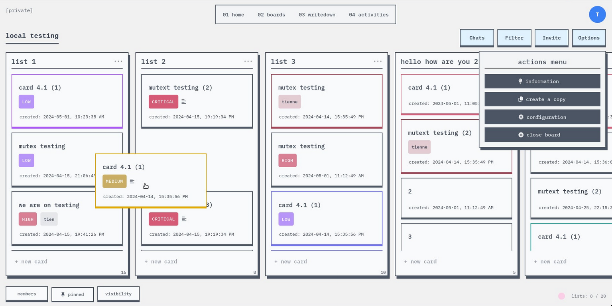

## task-manager (wip)

Trello-like task-manager web application built with MERN stack and Socket.io (come with drag and drop lists/cards, chats,...).

> Shout out to Trello - my favorite tool, and I use it for every project I make. I want to build a web application like it but modify some stuff to fit my taste.



---

### Quickstart

1. Clone this repo
2. At server folder - create .env
    ```
    // .env
    PORT=3001
    ACCESS_TOKEN=accesstokensecret
    REFRESH_TOKEN=refreshtokensecret
    ```
3. Install packages and run command at 3 folders: server, client, socket
   ```bash
   // shell
   npm install
   npm run dev
   ```
4. Open http://localhost:5173/
