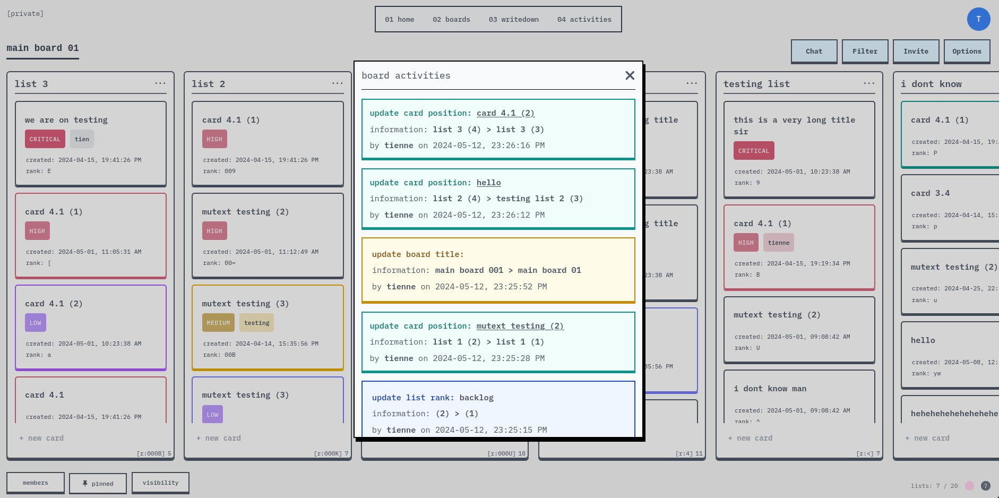
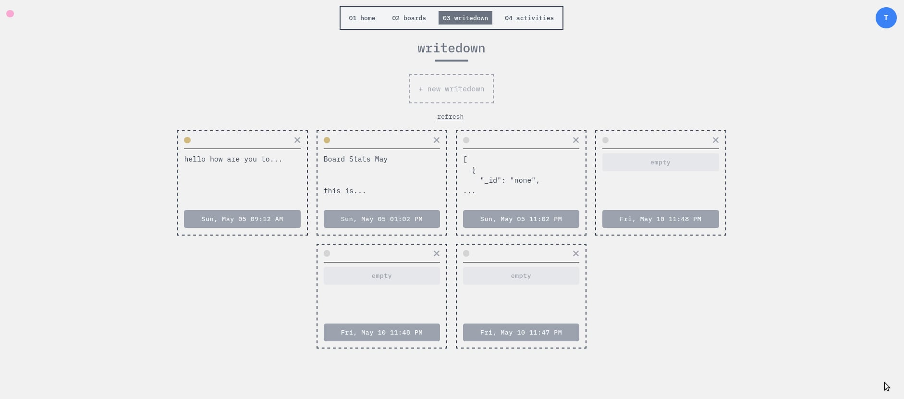

## task-manager (v0.1.1)

Task Manager application built with MERN stack and Socket.io (come with drag and drop lists/cards, chats, notes, history tracking, and simple keybindings...).

> Inspired by Trello - my favorite tool for daily work & side projects.

> I want to build something like it but modify some stuff to fit my taste.






---

Demo: [https://task-manager-1-server.onrender.com/](https://task-manager-1-server.onrender.com/)

---

### Quickstart

> Dependencies: node version >= 21.x

1. Clone this repo
2. Create database in mongodb (with your_database_name)
3. At `server` folder - create `.env` file with content like the example below,
   [follow this example](./server/.env.example)
    ```
    PORT=3001
    ACCESS_TOKEN=secretaccesstoken
    REFRESH_TOKEN=secretrefreshtoken

    # make sure <your_database_name> matches your database name in mongodb
    DB_CONNECTION=mongodb://127.0.0.1:27017/<your_database_name>
    ```
4. Install packages & Start
   ```bash
   # cd server
   npm install
   npm run dev

   # cd client
   npm install
   npm run dev

   # cd socket
   npm install
   npm run dev

   # bascripts (optional, run this without previous commands)
   bin/dev
   # or
   bin/dev2
   ```
5. Open `http://localhost:5173/`
   (If running `bin/dev2`): Open `http://localhost:3001/`

---

#### Run Tests

> Tests are currently deprecated, 'cause some big updates

```bash
cd server && npm test
```

For tests coverage visualization, run: `cd server && npm test -- --coverage`, then open `server/coverage/lcov-report/index.html`
